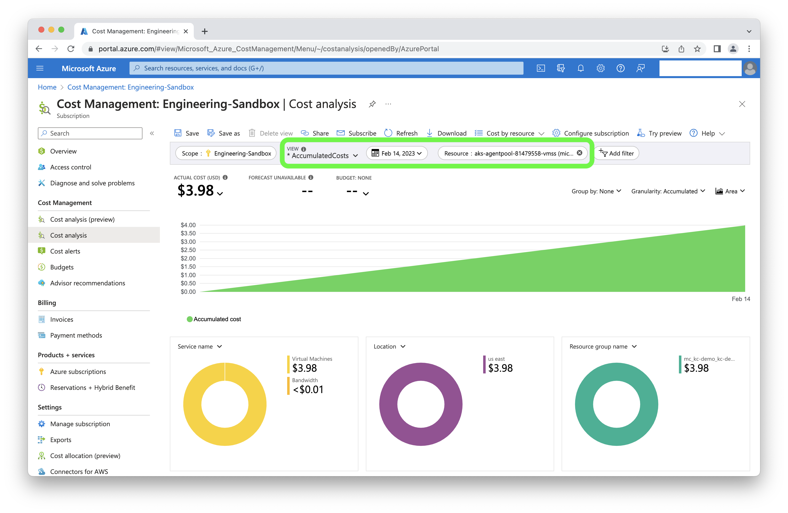

# Azure/nOps Data Audit

## Performing a data audit

First, in the nOps UI, [view the price of a single node for a single day](./). Note, that nOps breaks out each VM within a Virtual Machine Scale Set (VMSS) as its own line item.

Next, compare this node's costs with what is found in Azure Cost Management (Amortized). Ensure you adjust the date range, and filter for the VMSS.

## Troubleshooting non-matching costs

To determine what could cause a discrepancy between your instances' cost and Azure Cost Management, perform these troubleshooting measures:

* Check whether nOps's price of a single node for a single day matches with the Azure Cost Export CSV file. The CSV will be located in the bucket configured for [Azure Cloud Billing Integration](/install-and-configure/install/cloud-integration/azure-out-of-cluster/azure-out-of-cluster.md).
* Check whether the Azure Cost Export is [configured correctly](/install-and-configure/install/cloud-integration/azure-out-of-cluster/azure-out-of-cluster.md).
* Check whether the CSV line items in the Azure Cost Export match the Azure Cost Management Dashboard.
